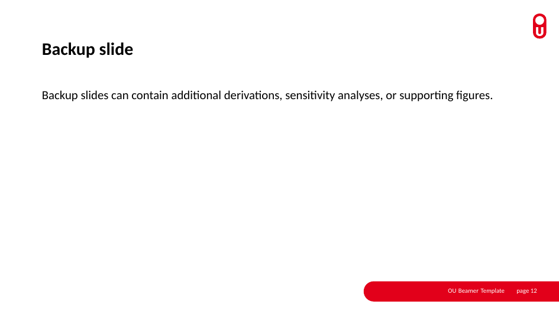
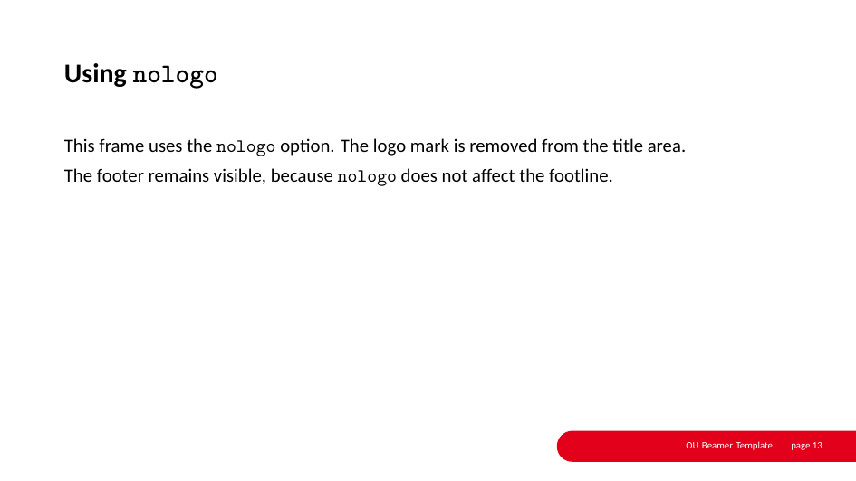
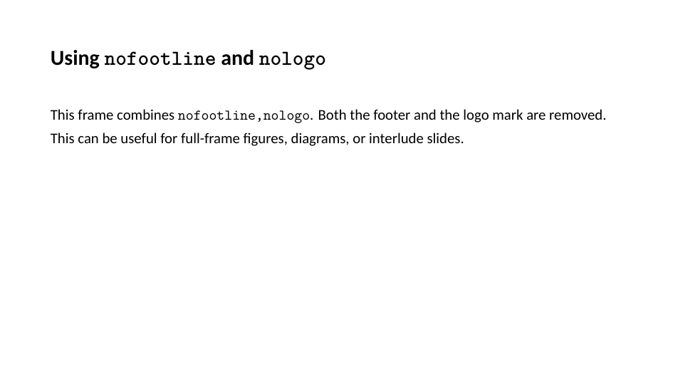
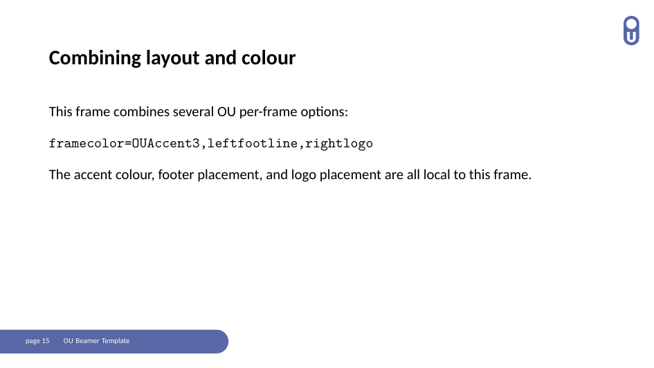
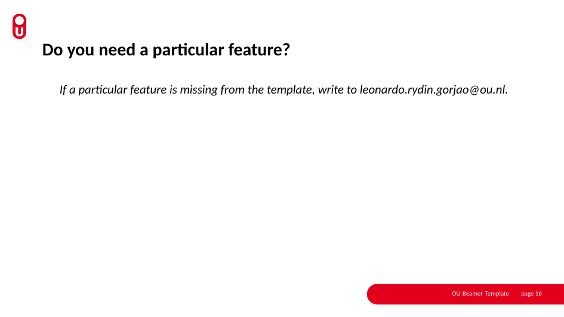
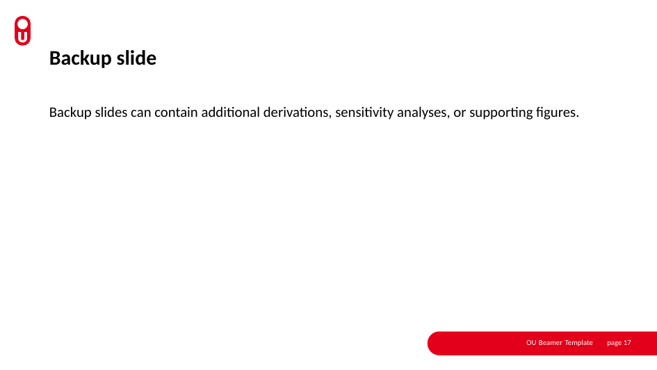

# OU-Beamer-Template
LaTeX Beamer Template for the Open University of the Netherlands

## OU fonts
The Open University of the Netherlands uses as standart `Calibri` and `Calibri Light` for presentations. These are proprietary fonts. In a linux system, you can install an open alternative to `Calibri`, `Carlito`, with

```shell
sudo apt update
sudo apt install fonts-crosextra-carlito fontconfig
sudo fc-cache -f
fc-match Carlito
```

and `Arial` with
```shell
sudo add-apt-repository multiverse
sudo apt update
sudo apt install ttf-mscorefonts-installer fontconfig
sudo fc-cache -f
fc-match Arial
```

## Beamer properties

This template is built around the `OU` Beamer theme and supports the following options and features:

### Theme options

- `lang=en|nl` selects English or Dutch labels and institute name.
- `font=calibri|carlito|arial|none` selects the main presentation font.
- `elevatedtitles=true|false` controls whether frame titles sit closer to the top of the slide.
- `serifmath=true|false` controls whether mathematics keeps the usual LaTeX serif style.
- `tightlists=true|false` slightly reduces vertical spacing in `itemize` lists.
- `footertitle=true|false` shows or hides the short title in the footer.
- `\title[Short footer title]{Full presentation title}` sets the short footer title.
- `\OUfootertitle{Different footer title}` overrides the footer title explicitly.

### Per-frame options

- `framecolor=<colour>` changes the accent colour for a single frame.
- `rightfootline`, `leftfootline`, and `nofootline` control footer placement and visibility.
- `leftlogo`, `rightlogo`, and `nologo` control logo placement and visibility.
- Standard Beamer frame options such as `t`, `plain`, `fragile`, and `noframenumbering` still work.

### Colours and environments

- Defined OU colours: `OUPrimary`, `OUAccent2`, `OUAccent3`, `OUwarmgrey`, `OUgreenish`, `OUlightblue`, `OUblack`, and `OUwhite`.
- The custom `ououtline` environment supports outline slides with `\itemdetails` entries and optional colour overrides.


## Preview
<picture>
  
  
  
  
  
  
  
  
  
  
  
  
  
  
  
  
  
  
</picture>

## Versioning

- `v0.0.1`: first version of the OU Beamer template, including the base OU theme setup, outline environment, and per-frame `framecolor` option.
- `v0.0.2`: added footer title support through the `footertitle` theme option and the `\title[Short footer title]{...}` mechanism.
- `v0.0.3`: added the `leftfootline` and `nofootline` per-frame layout options.
- `v0.0.4`: separates footline and logo placement: `leftfootline`, `rightfootline`, `nofootline`, `leftlogo`, `rightlogo`, and `nologo`.

